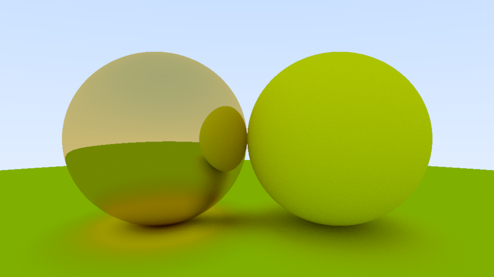
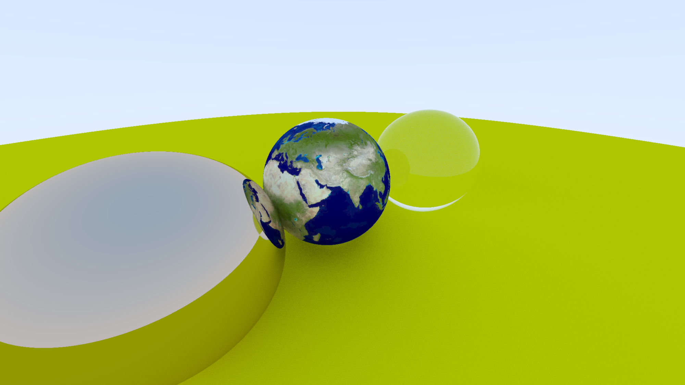
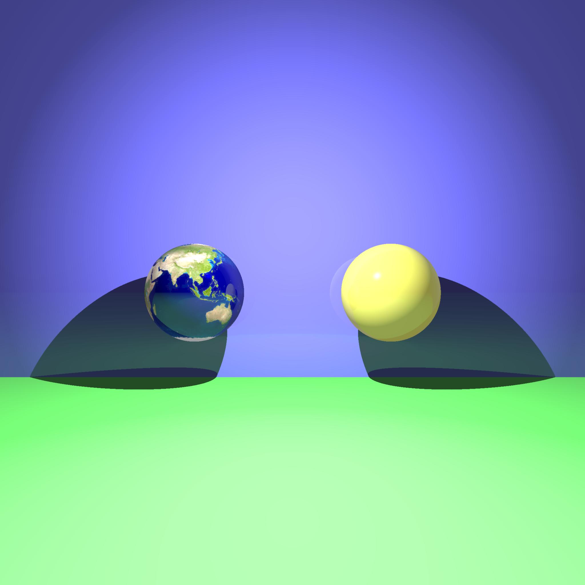
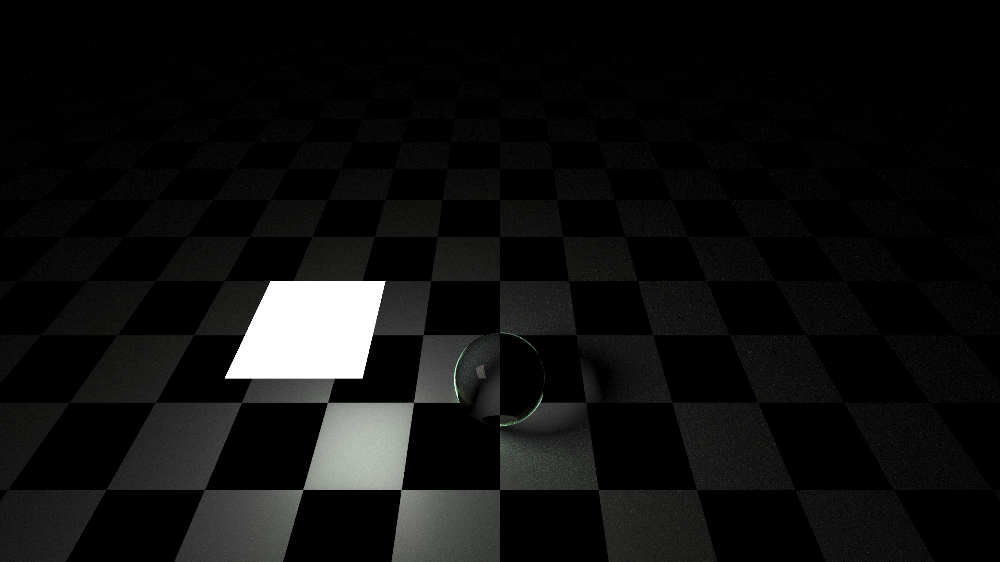
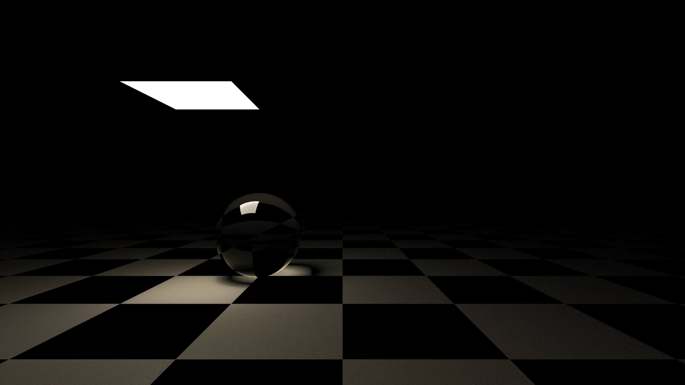
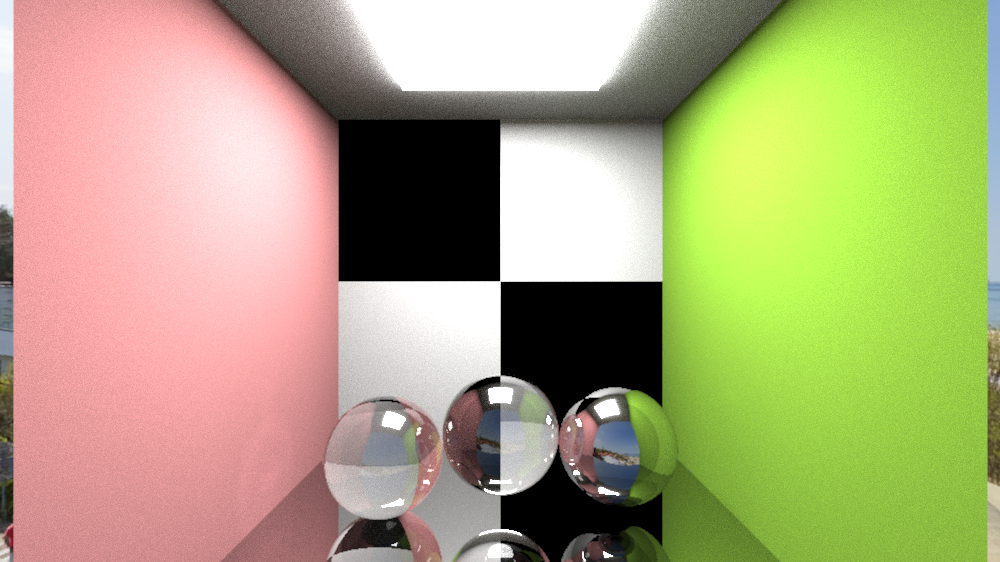

# rt: a ray tracer

Working on a ray tracer to learn about computer graphics. This project is still
very much work in progress!

Currently includes:

- Planes, Quads, Spheres
- Texture Mapping
- Lights: Point Lights, Quad Lights
- Phong Shading
- Path Tracing

Still need to add:

- Scene File Parser/Loader
- Support for Meshes

## How to run

This project is using CMake. To configure build directory:

```
$ cmake -S . -B build
```

and to compile run:

```
$ cd build/
$ make rt
```

To use `rt`:

```
usage: rt [ARGUMENTS]

ARGUMENTS:
-f | --out_file             PPM image output file name
-w | --image_width          PPM image width
-r | --aspect_ratio         Aspect ratio of image (default: 16/9, height = width / aspect_ratio)
-v | --vfov                 Vertical Field of View (default: 90, FOV in degrees)
-t | --defocus_angle        Defocus blur lens radius (default: 0.0 - no blur),
-h | --help                 Show this help message
-n | --nthreads             Multithreading (default: OS suggested value)
-a | --arealight_samples    Number of samples for area light (default: 10)
-p | --use_path_tracer      Use path tracer instead of default ray tracer
-d | --max_depth            Max ray bounce depth (default: 5)
-s | --samples_per_pixel    Number of rays cast for each pixel (default: 1000)
-l | --use_light_sampling   Use explicit light sampling
```

In order to test the normal maps, I also created a tool that converts height
maps to normal maps. To compile this conversion tool, run:

```
$ make height_map_conv
```

This tool converts the height map into a +z normal map - +z is the normal direction

### Running Tests

This project uses Catch2 for unit testing. All unit tests can be found in the
`tests/` directory.

To build the testing suite, use:

```
$ make tests
```

The testing executables are located at `bin/test_*`.

## Knowledge Resources

I first started by following this [online book](https://raytracing.github.io/),
but halfway through the second book, I felt like this book was more focused on
just implementing ray tracer instead of learning the actual concepts. So I
started doing my own thing by reading these
[lecture notes](http://www.cs.utoronto.ca/~strider/LectureNotes.html).

## Progress

Started following Ray Tracing in One Weekend. Got metallic and diffuse spheres
working.



Got texture maps working...



Started doing my own thing, following the lecture notes. Implemented Phong
illumination


Applying textures, shadows and Phong lighting...



Path Tracing is working!





Glass and metal reflections and the whole lot!


