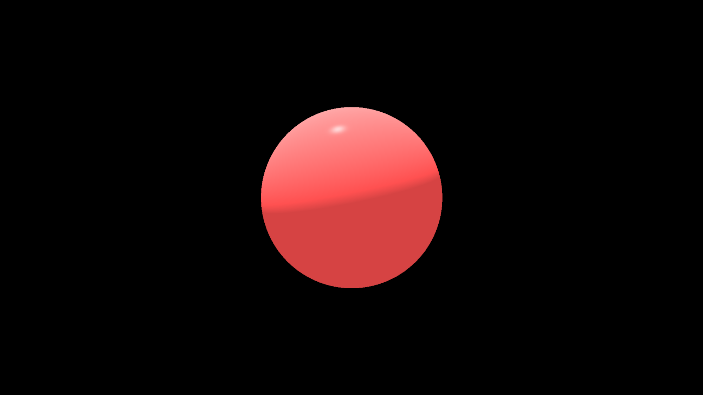

# rt: a ray tracer

Working on a ray tracer to learn about computer graphics.

Currently includes:
- Planes, Quads, Spheres
- Texture Mapping
- Lights: Point Lights, Quad Lights
- Phong Shading

Still need to add:

- Transparent materials (Glass)
- Bump/Normal Maps
- 

## Knowledge Resources

I first started by following this [online book](https://raytracing.github.io/),
but halfway through the second book, I felt like this book was more focused on
just implementing ray tracer instead of learning the actual concepts. So I
started doing my own thing by reading these 
[lecture notes](http://www.cs.utoronto.ca/~strider/LectureNotes.html).

## Progress

Started following Ray Tracing in One Weekend. Got metallic and diffuse spheres
working.

Got texture maps working...

Started doing my own thing, following the lecture notes. Implemented Phong 
illumination

Applying textures, shadows and Phong lighting...

